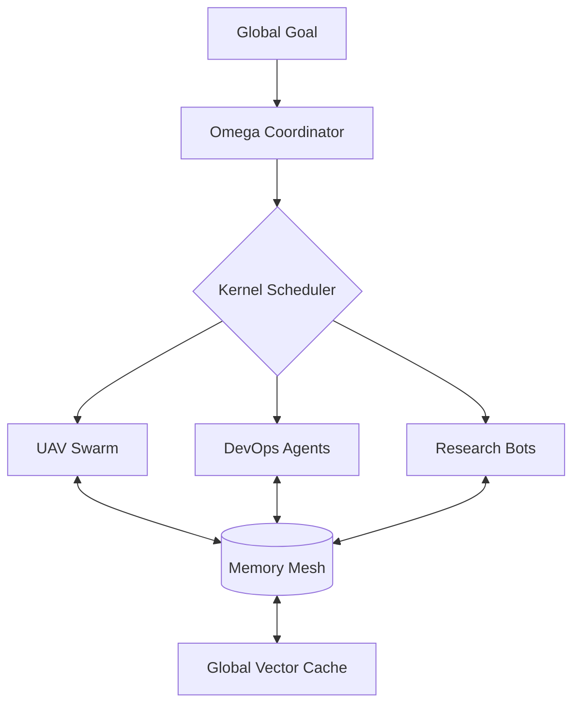

# 🌌 Omega-System: The Autonomous Swarm OS

[](https://opensource.org/licenses/MIT)
[](https://hackatime.hackclub.com)
[](https://github.com/AmSach/Omega-System)

**Omega-System is the backbone for the next generation of autonomous agent swarms.** 

While most agent frameworks are just wrappers around LLMs, Omega-System is a full **Operating Layer**. It provides the low-level "nervous system" for agents to communicate, remember, and execute tasks across distributed hardware—from tiny edge robots to massive GPU clusters.

## 🌟 Why Omega-System?

In a world where everyone has an AI, the winner is the one who can **coordinate** them. Omega-System solves the "Coordination Problem" for swarms:
- **Shared Consciousness**: A vectorized Memory Mesh that lets agents share knowledge in real-time.
- **Agentic Kernel**: A resource-aware scheduler that handles task delegation better than a human project manager.
- **Hardware Agnostic**: Run the same swarm logic on your laptop, a Raspberry Pi, or 100 H100s.

## 🏗 System Architecture



## 🛠 Deep Features

### 🧠 Vector Memory Mesh
The Memory Mesh (`core/mesh.py`) implements a high-performance vector storage layer using `numpy`. It allows agents to perform cosine similarity searches over their collective history, enabling "context-aware" swarm intelligence.

### ⚙️ Agentic Kernel
The Kernel (`core/kernel.py`) is the central nervous system. It manages the task lifecycle from registration to execution, handling node health monitoring and automatic failure recovery.

### 🌐 Distributed Command Center
Our real-time dashboard provides a bird's-eye view of the entire network, visualizing node health, job throughput, and memory flux in a futuristic interface.

## 📦 Rapid Start

```bash
# Clone the nervous system
git clone https://github.com/AmSach/Omega-System.git
cd Omega-System

# Install core dependencies
pip install -e .

# Launch the Kernel
python3 scripts/launch_kernel.py
```

## 📊 Roadmap
- [x] **v1.0**: Core Kernel & Memory Mesh (Stable)
- [x] **v1.1**: Real-time Dashboard (Live)
- [ ] **v1.2**: ROS2 Bridge for physical robotics integration
- [ ] **v1.3**: Cryptographic authentication for swarm nodes

---
*Built for the Hack Club Hackatime Challenge. 300 Hours in progress.*
