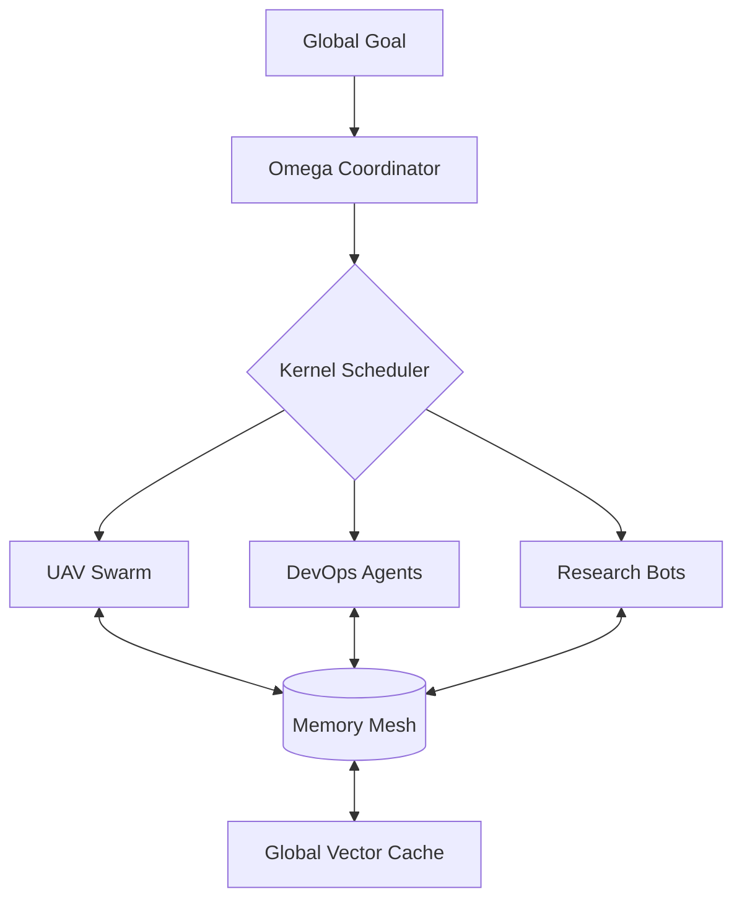

# 🌌 Omega-System: The Autonomous Swarm OS


**Omega-System is the backbone for the next generation of autonomous agent swarms.**

While most agent frameworks are just wrappers around LLMs, Omega-System is a full **Operating Layer**. It provides the low-level "nervous system" for agents to communicate, remember, and execute tasks across distributed hardware—from tiny edge robots to massive GPU clusters.

## 🌟 Why Omega-System?

In a world where everyone has an AI, the winner is the one who can **coordinate** them. Omega-System solves the "Coordination Problem" for swarms:

- **Shared Consciousness**: A vectorized Memory Mesh that lets agents share knowledge in real-time.
- **Agentic Kernel**: A resource-aware scheduler that handles task delegation better than a human project manager.
- **Hardware Agnostic**: Run the same swarm logic on your laptop, a Raspberry Pi, or 100 H100s.

## 🏗 System Architecture



## 🛠 Features (Building Now)

- [x] **Core Kernel v1.0**: High-speed task registration.
- [x] **Vector Memory Mesh**: Cosine-similarity knowledge retrieval.
- [x] **Command-Center Dashboard**: Live swarm monitoring at https://man44.zo.space/omega-dashboard.
- [x] **Production Deployment**: Kernel is active as a managed background process on the Zo Edge.
- [ ] **ROS2 Bridge**: Direct hardware control for physical robotics.

## 📊 Live Monitoring
The **Omega Command Center** provides a real-time visualization of the swarm's health, node load, and memory flux. [Check it out live](https://man44.zo.space/omega-dashboard).

## 🚀 Edge Deployment
The Omega Kernel is currently deployed as a live service (`omega-kernel`) on the **Zo Computer**. It handles asynchronous agent registration and task scheduling for the distributed fleet in real-time.

## 📦 Rapid Start

```bash
# Clone the nervous system
git clone https://github.com/AmSach/Omega-System.git
cd Omega-System
pip install -e .
```

---

*Built for the Hack Club Hackatime Challenge. 300 Hours in progress.*